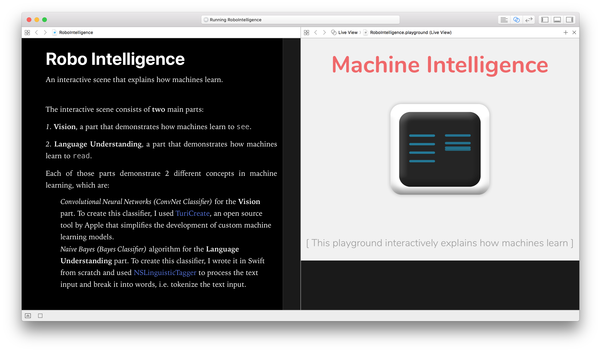

# Robo
An interactive scene written in Swift that explains how machines learn.
## Preview


## Description
The interactive scene consists of **two** main parts:
 
 1. **Vision**, a part that demonstrates how machines learn to `see`.
 2. **Language Understanding**, a part that demonstrates how machines learn to `read`.
 
 Each of those parts demonstrate 2 different concepts in machine learning, which are:
 - *Convolutional Neural Networks (ConvNet Classifier)* for the **Vision** part. To create this classifier, I used [TuriCreate](https://github.com/apple/turicreate), an open source tool by Apple that simplifies the development of custom machine learning models.
 
 
 - *Naive Bayes (Bayes Classifier)* algorithm for the **Language Understanding** part. To create this classifier, I wrote it in Swift from scratch and used [NSLinguisticTagger](apple-reference-documentation://csfoundation.nslinguistictagger) to process the text input and break it into words, i.e. tokenize the text input.


 ## Experience the interactive scene
 In order to test the scene, make sure to:
 
 1. Click execute playground
 2. Click show assistant editor

 ## Try out the classifiers
 
 ### Naive Bayes Classifier
 ```
 let classifier = MathBioClassifier()
 let result = classifier.predict("types of cells in living organisms")
 print(result)
 ```
 
 
 ### Convolutional Neural Networs Classifier
 ```
 let image = UIImage(named:"Data/Test Images/img_00.png")!
 let classifier = AppleBananaClassifier()
 if let buffer = image.buffer {
    do {
        let prediction = try classifier.prediction(image: buffer)
        print(prediction.fruitType)
    }catch{
        print(error)
    }
 }
 ```
